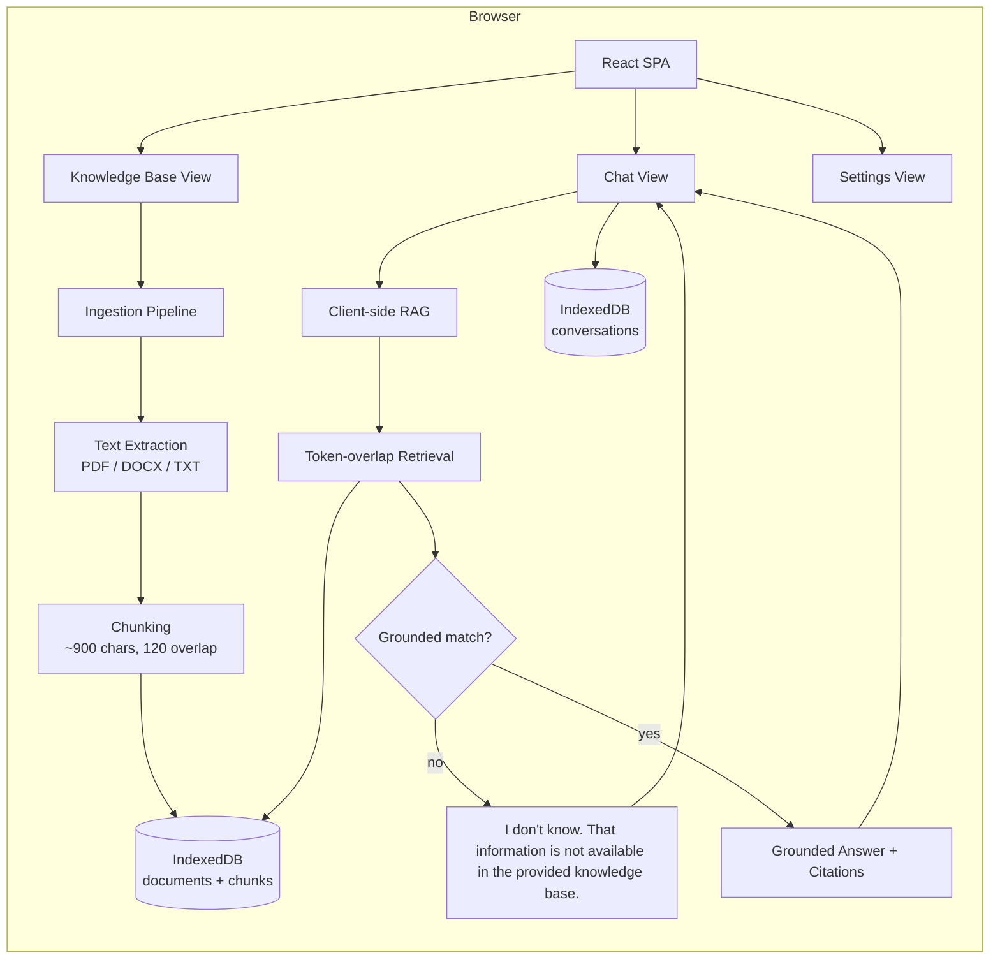
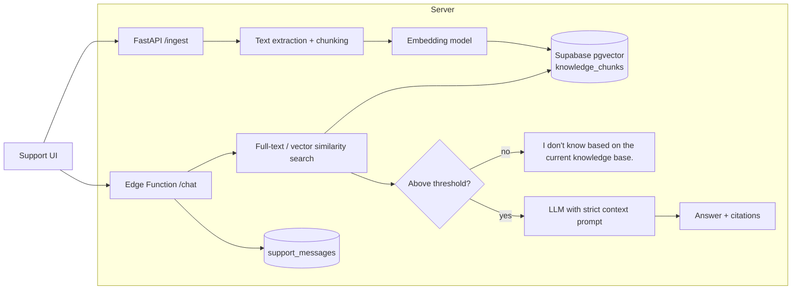

# Architecture

## Overview

Atlas Support AI is a single-page application that implements a retrieval-augmented generation (RAG) pipeline entirely in the browser, with optional server-side services for production deployments.

## High-Level Diagram

## Optional Backend Services

## Component Responsibilities

| Component | Responsibility |
| --- | --- |
| `App.tsx` | Root state: active view, documents, conversations, messages. Wires event handlers. |
| `Sidebar` | Navigation tabs, conversation list, new chat button. |
| `ChatView` | Message list, composer, suggestions, citations, fallback badge, export. |
| `KnowledgeView` | Upload dropzone, document list, search filter, delete menu. |
| `SettingsView` | Workspace stats, clear conversations, about. |
| `lib/documents.ts` | File parsing, chunking, ingestion into IndexedDB. |
| `lib/rag.ts` | Tokenization, retrieval, answer composition, fallback. |
| `lib/db.ts` | IndexedDB wrapper for documents, chunks, and conversations. |
| `lib/types.ts` | Shared TypeScript interfaces. |

## RAG Pipeline

1. **Ingestion** — `ingestDocument()` parses the file, normalizes whitespace, and splits text into overlapping chunks of ~900 characters with 120-character overlap.
2. **Storage** — Documents and chunks are stored in IndexedDB (`atlas-support-ai` database, `documents` and `chunks` object stores).
3. **Retrieval** — `searchKnowledge()` tokenizes the query (lowercased, punctuation stripped, tokens > 2 chars) and scores each chunk by the fraction of query tokens it contains.
4. **Generation** — The top matching chunk is used to compose a grounded answer, and the source document name is attached as a citation.
5. **Fallback** — If no chunk contains any query token, the strict fallback is returned.

## Guardrails

- Retrieval is performed before any answer is composed.
- Answers only use content found in uploaded documents.
- A score threshold prevents weak matches from being treated as grounded.
- Conversation history is persisted for context but is never treated as a knowledge source.
- Provider secrets are kept server-side only.

## Data Persistence

| Store | Location | Contents |
| --- | --- | --- |
| `documents` | IndexedDB | Document metadata and status. |
| `chunks` | IndexedDB | Extracted text chunks per document. |
| `conversations` | IndexedDB | Conversation sessions with full message history. |

When the optional backend is enabled, the same logical data lives in Supabase tables (`knowledge_documents`, `knowledge_chunks`, `support_conversations`, `support_messages`).
